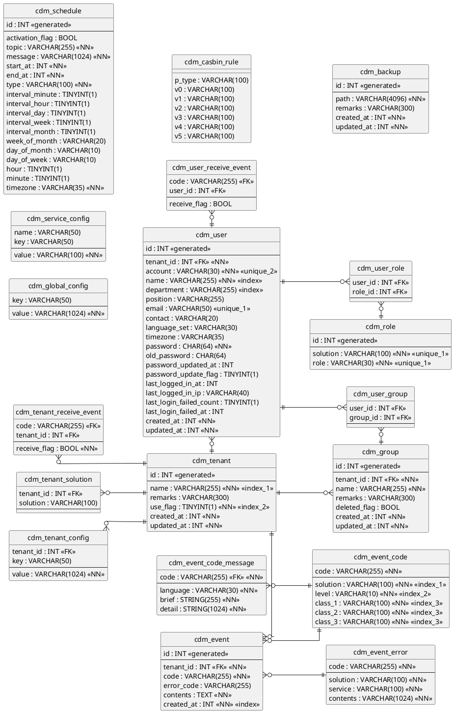

# DataBase

**Table of Contents**

- [SCHEMA](#SCHEMA)
- [ERD](#ERD)

---

## SCHEMA

### 개요

* CDM-CLOUD Database Schema
* ['기능 목록'](../functions.md) 참조하여 작성

### 스크립트

* [DDL 스크립트](cdm-cloud-ddl.sql)
* [DML 스크립트](cdm-cloud-dml.sql)
* [EventCode DML 스크립트](event-code-dml.sql)
* [EventCodeMessage DML 스크립트](event-code-message-dml.sql)
* [EventError DML 스크립트](event-error-dml.sql)
---

## ERD

